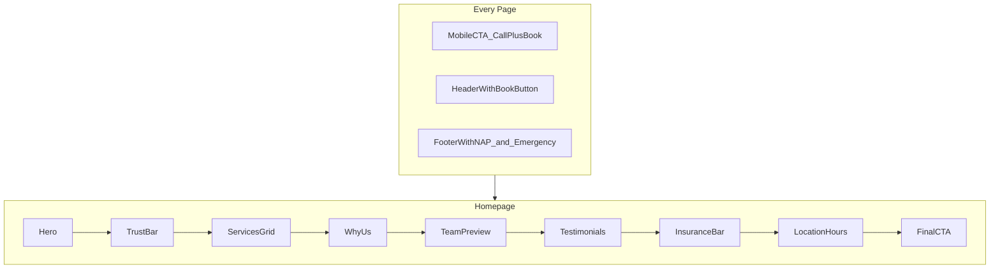

# Dental Clinic Website — Implementation Plan

> **Status:** Implemented in `/Users/oleksandr/dental-clinic-site`  
> Greenfield Next.js frontend for a full multi-page, high-conversion dental clinic website.

---

## Goals (Achieved)

- **Conversion** — Book and Call CTAs in header, sticky mobile bar, dual CTAs on homepage hero, final CTA band
- **Trust** — Trust bar (rating, years, patients), testimonials, team profiles, insurance logos
- **Anxiety reduction** — Warm copy, FAQ with categories/search, transparent cost disclaimers
- **Local discovery** — SEO metadata per page, LocalBusiness + FAQPage + Person JSON-LD
- **Accessibility** — Skip link, semantic landmarks, 44px tap targets, reduced-motion support
- **Frontend-only forms** — Book and Contact forms with zod validation + success UI

---

## Tech Stack

| Layer | Choice |
|-------|--------|
| Framework | Next.js 16 (App Router) |
| Language | TypeScript |
| Styling | Tailwind CSS v4 + `@theme` tokens |
| Components | shadcn/ui (Button, Card, Accordion, Input, Label, Textarea, Sonner) |
| Icons | lucide-react |
| Forms | react-hook-form + zod |
| Fonts | DM Sans via `next/font` |

---

## Routes Implemented

| Route | File | Status |
|-------|------|--------|
| `/` | `src/app/page.tsx` | Home funnel (9 sections) |
| `/services` | `src/app/services/page.tsx` | Service grid |
| `/services/[slug]` | `src/app/services/[slug]/page.tsx` | Detail + sticky book sidebar |
| `/about` | `src/app/about/page.tsx` | Story, mission, tech, certs |
| `/team` | `src/app/team/page.tsx` | Team grid |
| `/team/[slug]` | `src/app/team/[slug]/page.tsx` | Profile + Person schema |
| `/contact` | `src/app/contact/page.tsx` | Form + NAP + map |
| `/faq` | `src/app/faq/page.tsx` | Category grid, search, accordion |
| `/book` | `src/app/book/page.tsx` | Appointment request form |
| `/privacy` | `src/app/privacy/page.tsx` | Privacy policy |
| `/terms` | `src/app/terms/page.tsx` | Terms of service |

---

## Design System

Tokens in `src/app/globals.css`:

- **Background:** `#faf9f7` (warm off-white)
- **Primary:** `#0d9488` (teal-600)
- **Emergency accent:** `#e11d48` (rose-600) — footer emergency banner only
- **Radius:** `0.75rem`
- **Buttons:** `rounded-full`, `min-h-11`
- **Cards:** `rounded-xl`, border, shadow-sm, hover lift

---

## Content Architecture

Single source of truth: `src/data/site.ts`

| File | Contents |
|------|----------|
| `src/data/site.ts` | Clinic NAP, hours, phone, map, stats |
| `src/data/services.ts` | 6 services with steps, benefits, FAQ links |
| `src/data/team.ts` | 4 team members with bios |
| `src/data/testimonials.ts` | 6 patient reviews |
| `src/data/faq/index.ts` | 23 FAQs, insurance list, why-us items, about content |

---

## Conversion Patterns



1. Dual CTAs above fold (Book + Call)
2. Sticky mobile bar (Call | Book)
3. Trust bar below hero
4. Social proof (testimonials section)
5. Insurance friction removal
6. Emergency path in footer (rose banner → call + FAQ)
7. Service pages: sticky book sidebar on desktop

---

## SEO & Structured Data

| Location | Schema |
|----------|--------|
| `src/app/layout.tsx` | `Dentist` / `LocalBusiness` via `LocalBusinessJsonLd` |
| `src/app/faq/page.tsx` | `FAQPage` via `FAQJsonLd` |
| `src/app/team/[slug]/page.tsx` | `Person` inline script |
| All pages | `createPageMetadata()` — title, description, canonical, OpenGraph |

Set `NEXT_PUBLIC_SITE_URL` in `.env.local` for production canonical URLs.

---

## Forms (Frontend-Only)

| Form | Component | Validation |
|------|-----------|------------|
| Contact | `src/components/forms/ContactForm.tsx` | `contactFormSchema` |
| Book | `src/components/forms/BookForm.tsx` | `bookFormSchema` |

**To wire backend:** Create `src/app/api/contact/route.ts` and `src/app/api/book/route.ts`, replace `console.log` in `onSubmit` with `fetch`.

---

## Customization Checklist

- [ ] Update `src/data/site.ts` with real clinic info
- [ ] Replace Unsplash team/hero images with clinic photography
- [ ] Update `mapEmbedUrl` with real Google Maps embed
- [ ] Set `NEXT_PUBLIC_SITE_URL` for production
- [ ] Connect forms to email/CRM/scheduling API
- [ ] Add GA4 via env-gated script in layout (optional)

---

## Commands

```bash
npm install
cp .env.example .env.local
npm run dev      # http://localhost:3000
npm run build    # Production build (22 static pages)
npm run lint     # ESLint
```

---

## Future Enhancements (Out of Scope)

- Backend form submission (Supabase, Resend, Cal.com)
- CMS for non-dev content edits
- i18n (EN/UK)
- Blog for SEO content marketing
- Online scheduling widget embed
- Dark mode (intentionally omitted for clinical trust)

---

## Success Criteria

- [x] Every page has visible Book or Call CTA (header + mobile sticky bar)
- [x] Homepage complete trust + conversion funnel (9 sections)
- [x] All 7 core routes + legal pages render with static content
- [x] Forms validate with accessible error states + success UI
- [x] `npm run build` passes with zero TypeScript errors
- [x] `npm run lint` passes
